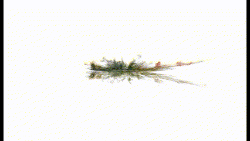

# simple-visualdataset
A repository to make an outdoor dataset from a camera phone and make a 3D map using COLMAP.

# Capturing your own dataset
1. Capture a video through your camera phone. Mine is an iPhone 13. The setting I used can be seen as follows:
```
>> Resolution: 4K 2160x3840
>> FPS: 30
```
2. The iPhone image's result is not that bad. However, you can use a third-party calibration tool if you prefer to take another calibration.
3. To make a good dataset using COLMAP, it is better to use a lot of images from different mapping of views. The less you take, the sparse the 3D map becomes.
4. Place your dataset into a folder named `images` in the main directory. Mine is under the `fountain` folder.
5. Now, let's make the simplest 3D map using COLMAP.

# Making a 3D Map Using COLMAP
1. First, install COLMAP on your machine. Please refer to this [repository](https://github.com/colmap/colmap)
2. I prefer to prepare all of the needed folders in advance. So, let's make the empty folder `sparse` to store the sparse map later and the `dense` folder if you want to make the dense map upon the sparse map. Both of the folders are generated under the `fountain` directory.
3. Now, extract the features of our images. The default one in COLMAP is using the SIFT method. I found that SIFT provides sufficient extracted features for every image. But, we can also use another method. I once used the deep learning-based method to extract the features and store them in the `.db` file (Yes, we need the `.db` file to run the COLMAP)
```
colmap feature_extractor \
--database_path ~/fountain/database.db \    #this is where we store the .db files
--image_path ~/fountain/images              #this is where we store all of the captured images
```
In this part, we actually can specify the intrinsic parameter. So, if you have your own calibration (aside from the EXIF information of the image, better to specify it here).
4. Matching the images. Like its name, in this stage, we will match features between images. Let's say if we find a compatible match, we can do the triangulation later.
```
colmap exhaustive_matcher \
--database_path ~/fountain/database.db
```
5. Build the sparse map from a set of matched images previously. In this process we determine the pose of each camera (images), triangulate the 3D points, and refine the results using the bundle adjustment. For a better understanding, I think it's better to dive into the mapper code in [COLMAP repo](https://github.com/colmap/colmap).
```
colmap mapper \
    --database_path ~/fountain/database.db \
    --image_path ~/fountain/images \
    --output_path ~/fountain/sparse       #the folder to store the sparse map
```
After we run the mapper, there will be a 3 results file under the `sparse` folder.
```
~/fountain/
+── sparse
│   +── cameras.bin
│   +── images.bin
│   +── points3D.bin

>> cameras.bin: store the camera models and the intrinsic parameters
>> images.bin store the camera pose and image2point correspondences (2D-3D correspondence)
>> points3D.bin: store the reconstructed 3D points

```
If we have a huge dataset, we can use `hierarchical_mapper` instead of `mapper`. I tried it and personally not such a fan.
6. Visualizing the sparse map. The 3 files under the sparse folder can be visualized using the COLMAP GUI. Using the import model menu, we can visualize the result as follows:

<div style="text-align: center;">
  
</div>


7. __Not necessary stuff__, but if you want to make a denser map (for better visualization), you can do these steps. I personally, do not use this frequently because it takes your storage more. Start with undistorting the images:
```
colmap image_undistorter \
--image_path ~/fountain/images \
--input_path ~/fountain/sparse \
--output_path ~/fountain/dense \
--output_type COLMAP \
--max_image_size 480   #or set another maximum output you want
```
8. Perform setero fusion:
```
colmap stereo_fusion \
--workspace_path  ~/fountain/dense \
--workspace_format COLMAP \
--input_type geometric \
--output_path  ~/fountain/dense/fused.ply
```
9. Apply the Poisson Mesher (Or another one).
```
colmap poisson_mesher \
--input_path ~/fountain/dense/fused.ply \
--output_path ~/fountain/dense/meshed-poisson.ply
```
Now it's done! We can extract the pose of every image for making a dataset (It's a W2C pose). If we need C2W, then we need to perform another transformation!
